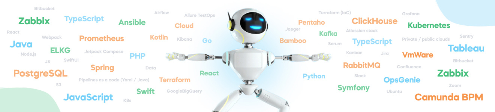

<h1 align="center">Hi there 👋</h1>
<p align="center"></p>

<p align="center">
<a title="GitHub followers" href="https://github.com/deshtuka" ></a>
<a title="GitHub stars" href="https://github.com/deshtuka" ></a>
<a title="Profile views" href="https://github.com/deshtuka" ></a>
</p>

###  A little more about me...  

```javascript
anmol = {
    pronouns: "He" | "Him",
    code: ["Python", "Javascript", "HTML", "CSS", "Java"],
    askMeAbout: ["dev", "qa", "qa automation"],
    technologies: {
        qaDev: {
            python: {
                webTest: ["UnitTest", "Pytest", "Behave", "RobotFramework"],
                stressTest: ["Locust"],
                mobileTest: ["Appium"]
            }
        },
        frontEnd: {
            js: ["AngularJS"]
        },
        backEnd: {
            python: ["FastAPI"]
        },
        devOps: {
            orchestration: ["Docker🐳", "Kubernetes"],
            ci_cd: ["Jenkins", "Gitlab"],
            brokers: ["Kafka", "RabbitMQ"]
        },
        databases: {
            SQL: ["PostgreSQL", "SQLite", "MySQL"],
            noSQL: ["MongoDB", "Redis", "ClickHouse"]
        },
        misc: ["selenium", "aiogram", "aiohttp", "telebot", "open-cv", "pandas"]
    },
    methodology: ["OOP", "SOLID", "Test theory", "Base pattern"],
};
```

### 🤙🙂 Contacts: 
[](https://t.me/deshtuka)

### ⚙️ GitHub Analytics

<body>
  <div>
    
  </div>
  <div>
    
    
  </div>
</body>
